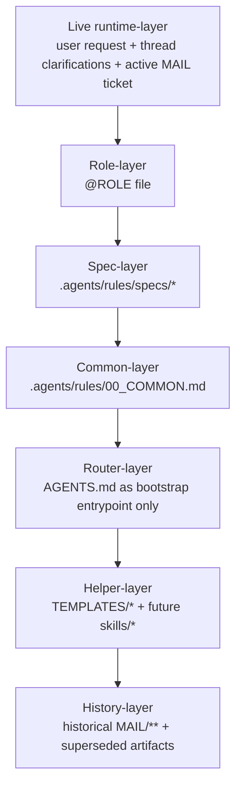

# ANALYST REPORT

Role: ANALYST
TicketId: T0015
SourceTicket: `.agents-runtime/MAIL/ANALYST/IN/T0015_20260417-1758_ANALYST_synthesize-rule-architecture-from-evidence-pack.md`
CreatedAt: 2026-04-17
Workspace: `D:\.DEV\JetBrainsPlagins`

## 1. Финальный bootstrap-flow

1. Войти через `AGENTS.md` как единственный bootstrap-entrypoint.
2. Из `AGENTS.md` загрузить только repo-wide rule-layer:
   `.agents/rules/00_COMMON.md`
   `.agents/rules/specs/CONTROL_FLOW.md`
3. Если в запросе есть явный `@ROLE`, загрузить только соответствующий role-file.
4. После загрузки rule-layer прочитать текущий пользовательский запрос и активный `MAIL/**`-тикет как task-local contract.
5. Дочитать только те артефакты, на которые активный тикет явно ссылается или без которых остаётся неустранимая неоднозначность.
6. Использовать `TEMPLATES/*` только как scaffolding для формы новых process-файлов и только после чтения rules и активного тикета.
7. Использовать `skills/*` только как opt-in recipes для повторяемых процедур и никогда не включать их в bootstrap автоматически.
8. Использовать historical `MAIL/**` только как evidence/history layer, а не как текущий нормативный слой.
9. Любые уточнения пользователя в текущем треде трактовать как runtime-уточнение текущей задачи поверх bootstrap-flow, но не как причину переписывать history.

Итог:
- цикл `AGENTS.md -> 00_COMMON.md -> AGENTS.md` должен быть устранён;
- bootstrap должен быть однонаправленным и заканчиваться на active task, а не уходить обратно в repo-router;
- templates, skills и history не участвуют в bootstrap как обязательные слои.

## 2. Финальная иерархия правил

Рекомендуемая архитектура задаётся как один стек слоёв:

1. Live runtime-layer: текущий пользовательский запрос, уточнения в треде и активный `MAIL/**`-тикет.
2. Role-layer: соответствующий `@ROLE`-файл.
3. Spec-layer: `.agents/rules/specs/*`.
4. Common-layer: `.agents/rules/00_COMMON.md`.
5. Router-layer: `AGENTS.md` только как entrypoint и маршрутизатор чтения, а не как место для дублирования полной нормативной логики.
6. Helper-layer: `TEMPLATES/*` и будущие `skills/*`, которые не имеют права переопределять слои 1-4.
7. History-layer: historical `MAIL/**` и superseded process-артефакты только как evidence.

Практический смысл этой иерархии:
- source of truth для текущего исполнения живёт в слоях 1-4;
- `AGENTS.md` не должен дублировать детальные process-правила, он только запускает нужную последовательность чтения;
- helper-layer помогает работать быстрее, но не меняет нормативные требования;
- history-layer нужен для анализа drift/conflicts, но не для прямого нормирования новой работы.

Диаграмма слоями:

## 3. Финальная граница rules, skills, templates, history

`rules`
- Хранят только инварианты системы: bootstrap, порядок применения слоёв, repo boundary, process-contract, conflict resolution, ownership и role duties.

`skills`
- Хранят повторяемые recipes, которые можно подключать по ситуации: process-consistency checks, создание process-артефактов по уже заданному контракту, build/debug recipes, тематические workflow для платформы JetBrains.
- Не имеют права менять содержательные требования rules, specs или active ticket.

`templates`
- Хранят формы-заготовки для новых `MAIL`-артефактов.
- Не считаются source of truth.
- Обязаны уступать rules/specs и active ticket при любом расхождении.
- Должны задавать каркас формы, а не собственный альтернативный process-contract.

`history`
- Хранит прошлые тикеты, отчёты и evidence.
- Используется для аудита, drift-analysis и извлечения кандидатов в rules/skills/templates.
- Не переписывается массово ради нормализации новой архитектуры.

## 4. Что остаётся в rules

- Единый bootstrap-entrypoint через `AGENTS.md`.
- Однонаправочный порядок чтения слоёв без возврата из `00_COMMON.md` обратно в `AGENTS.md`.
- Канонический workspace для актуальных правил и process-артефактов: `D:\.DEV\JetBrainsPlagins`.
- Repo boundary и запрет закладываться на изменения вне текущего репозитория.
- Process-contract по созданию/обновлению `MAIL/**`, проверке путей/артефактов перед завершением и единой централизованной runtime-policy для действий вроде показа/открытия process-файлов.
- Правила приоритета: active runtime/task > role > specs > common > helper > history.
- Ownership для `.agents-runtime/00_STATE.md` и для staging process-артефактов.
- Явное правило, что runtime-уточнения пользователя относятся к текущему выполнению, но не переписывают historical artifacts.

## 5. Что выносится в skills

- `PROCESS_ARTIFACT_WORKFLOW`
  Рецепт создания `MAIL/IN`, `MAIL/OUT`, follow-up и проверки ссылок/именования по уже заданным rules/templates.
- `PROCESS_CONSISTENCY_LINT`
  Рецепт локальной проверки согласованности `00_STATE`, `MAIL`, ссылок на артефакты и статусов.
- `INTELLIJ_PLATFORM_BUILD_COMPAT`
  Повторяемые команды и checks для совместимости JetBrains/IntelliJ Platform.
- `RIDER_DIFF_CONTEXT_COPY`
  Повторяемый workflow по diff-context copy.
- `IDE_LANGUAGE_DETECTION`
  Повторяемый workflow по определению IDE language/features.

Принцип выноса:
- если инструкция отвечает на вопрос "что в репозитории обязано быть истинным" - это rules;
- если инструкция отвечает на вопрос "как многократно и однотипно выполнять задачу" - это skill.

## 6. Как трактовать TEMPLATES

- `TEMPLATES/*` нужно закрепить как отдельный scaffolding/reference layer.
- `TEMPLATES/INDEX.md` должен явно говорить: шаблон ускоряет старт, но не заменяет active ticket и не спорит с rules/specs.
- `TASK.md`, `REPORT.md`, `VERIFY.md` должны быть подтянуты к устойчивой process-практике, но оставаться шаблонами, а не новым source of truth.
- `LEAD_PROMPT.md` не должен нести конфликтующую process-норму поверх `CONTROL_FLOW.md`; если особое действие вроде `Start-Process` действительно обязательно, оно должно жить в rules или в активном тикете, а не в helper-layer.
- Любая нехватка шаблона закрывается ужесточением конкретного тикета, а не silent override через шаблон.

## 7. Исторические артефакты, которые не нужно переписывать

- `.agents-runtime/MAIL/LEAD/IN/T0001_20260410-0108_LEAD_rider-plugin-bootstrap.md`
- `.agents-runtime/MAIL/ANALYST/IN/T0002_20260410-0130_ANALYST_specify-rider-plugin-copy-format-bootstrap.md`
- `.agents-runtime/MAIL/ANALYST/OUT/T0002_20260410-0130_ANALYST_specify-rider-plugin-copy-format-bootstrap_report.md`
- `.agents-runtime/MAIL/ANALYST/OUT/T0010_20260411-2202_ANALYST_specify-diff-copy-format-and-ide-language-detection_report.md`
- `.agents-runtime/MAIL/CODER/IN/T0003_20260410-0205_CODER_bootstrap-rider-plugin-and-implement-copy-action.md`
- `.agents-runtime/MAIL/CODER/OUT/T0003_20260410-0205_CODER_bootstrap-rider-plugin-and-implement-copy-action_report.md`
- `.agents-runtime/MAIL/CODER/OUT/T0011_20260411-2220_CODER_implement-ide-language-detection-and-diff-copy-format_report.md`
- Другие superseded `MAIL/**`-артефакты со старым workspace path и ранними process-практиками.

Причина:
- эти файлы нужны как evidence для drift и эволюции процесса;
- их массовая ретро-правка не решает текущую архитектурную проблему и только замусорит scope.

## 8. Factual cleanup

- Разорвать bootstrap-cycle между `AGENTS.md` и `.agents/rules/00_COMMON.md`.
- Перенести канонический workspace для новых правил и process-артефактов на `D:\.DEV\JetBrainsPlagins`.
- Убрать дублирование полной иерархии из `AGENTS.md`; оставить там только router-логику.
- Явно зафиксировать layer-stack и rule priority в одном месте common/spec-layer.
- Отделить helper-layer от source-of-truth layer на уровне формулировок.
- Уточнить `TEMPLATES/TASK.md` под фактический формат `IN`-тикетов: минимум `Scope`, `Не делать`, `Входные артефакты`, при необходимости `Обязательная форма OUT-отчёта`.
- Уточнить `TEMPLATES/REPORT.md` под фактический header-pattern `SourceTicket` и `Workspace`.
- Уточнить `TEMPLATES/VERIFY.md` под режим verifier-задач, где обязательные секции часто задаются входным тикетом.
- Убрать из `TEMPLATES/LEAD_PROMPT.md` самостоятельную conflict-driven process-норму и оставить только роль шаблона handoff/scaffold.
- Явно централизовать policy для runtime-действий вроде `Start-Process` в одном rule/spec-источнике или в active task contract, а templates оставить нейтральными.
- Завести physical `skills`-layer и явно запретить ему переопределять rules.
- Закрепить ownership и expected update-flow для `.agents-runtime/00_STATE.md`.
- Не выполнять массовую ретро-правку old `MAIL/**`.

## 9. Change-plan для CODER

1. Нормализовать bootstrap.
   Исправить `AGENTS.md`, `.agents/rules/00_COMMON.md` и при необходимости `specs/*`, чтобы чтение было однонаправочным и без циклов.
2. Зафиксировать каноническую иерархию.
   В одном repo-wide месте явно записать финальный layer-stack, приоритет active task и статус helper/history слоёв.
3. Нормализовать workspace-path.
   Перевести актуальные rules/specs/templates на `D:\.DEV\JetBrainsPlagins`, оставив старый путь только как historical evidence там, где это нужно.
4. Развести rules и helper-layer.
   Уточнить формулировки так, чтобы `TEMPLATES/*` и будущие `skills/*` были явно вторичными к rules/specs и active ticket.
5. Починить template-layer.
   Дотянуть `TEMPLATES/INDEX.md`, `TASK.md`, `REPORT.md`, `VERIFY.md`, `LEAD_PROMPT.md` до согласованности с фактической process-практикой и rule priority.
6. Ввести physical skills-layer.
   Создать каркас `.agents/skills` и перенести туда только reusable recipes, не затрагивая конституционные нормы.
7. Зафиксировать ownership process-state.
   Явно описать, кто и когда обновляет `.agents-runtime/00_STATE.md`, и как staging process-артефактов входит в definition of done.
8. Прогнать точечную сверку.
   После правок проверить существование путей, внутренние ссылки, согласованность шаблонов с rules/specs и отсутствие нового bootstrap-cycle.

## 10. File-pack для ChatGPT 5.4 Pro

Рекомендуемый upload pack должен состоять ровно из 4 файлов:

1. Новый synthesis-файл `T0015 ... _file-pack.md` как primary architecture brief.
2. `T0014 ... _report.md` как evidence-first summary первого прохода.
3. `T0014 ... _evidence-pack.md` как compact hotspot appendix.
4. `T0016 ... _report.md` как независимая verifier-проверка template-side конфликтов.

Почему именно так:
- один файл даёт конечную архитектурную рекомендацию;
- два файла из `T0014` дают достаточную доказательную базу без нового раскопа репозитория;
- verifier-отчёт отдельно подтверждает, что template-layer ещё не нормализован.

Рекомендуемые заготовки для разбиения итогового материала по 4 "простыням":

1. `00_EXEC_SUMMARY.md`
   Управляющий документ пакета: цель, финальный вывод, одна рекомендуемая архитектура, один bootstrap-flow, одна иерархия слоёв, change-plan верхнего уровня, что обязательно читать и что не нужно пересобирать заново.
2. `01_ARCHITECTURE.md`
   Архитектурная простыня: проблема текущего состояния, финальный bootstrap-flow, финальная иерархия правил, граница `rules / skills / templates / history`, роль runtime-layer, трактовка `TEMPLATES/*`, диаграмма и финальные решения.
3. `02_EVIDENCE.md`
   Доказательная простыня: подтверждённые конфликты, drift-зоны, file hotspots, evidence по bootstrap-cycle, `Start-Process`, path drift и template mismatch, плюс фиксация того, что уже доказано и не требует нового раскопа.
4. `03_CHANGE_PLAN.md`
   Исполнительская простыня для следующего `CODER`: factual cleanup, порядок правок, что менять в `rules`, что менять в `templates`, что выносить в `skills`, что не трогать в `history`, definition of done и минимальные проверки.

Правило раскладки фрагментов:
- всё, что отвечает на вопрос "какое финальное решение принято" -> `00_EXEC_SUMMARY.md`;
- всё, что отвечает на вопрос "как устроена рекомендуемая система" -> `01_ARCHITECTURE.md`;
- всё, что отвечает на вопрос "чем это подтверждено" -> `02_EVIDENCE.md`;
- всё, что отвечает на вопрос "что делать руками дальше" -> `03_CHANGE_PLAN.md`.

## 11. Список файлов для загрузки в ChatGPT 5.4 Pro

Загружать нужно эти 4 файла:

1. `.agents-runtime/MAIL/ANALYST/OUT/T0015_20260417-1758_ANALYST_synthesize-rule-architecture-from-evidence-pack_file-pack.md`
   Это главный upload-ready документ с одной рекомендуемой архитектурой, bootstrap-flow, границами слоёв и change-plan.
2. `.agents-runtime/MAIL/ANALYST/OUT/T0014_20260417-0220_ANALYST_audit-agent-rules-and-design-skill-extraction_report.md`
   Это краткая карта конфликтов, кандидатов и cleanup-направлений из первого прохода.
3. `.agents-runtime/MAIL/ANALYST/OUT/T0014_20260417-0220_ANALYST_audit-agent-rules-and-design-skill-extraction_evidence-pack.md`
   Это компактный evidence appendix с точечными hotspot-ссылками и фактами по drift/conflicts.
4. `.agents-runtime/MAIL/VERIFIER/OUT/T0016_20260417-1803_VERIFIER_validate-templates-against-rules-and-process_report.md`
   Это независимое подтверждение, что `TEMPLATES/*` пока не могут считаться нормализованным template-layer.

Ожидаемый результат такого пакета:
- ChatGPT 5.4 Pro получает одну уже синтезированную архитектуру вместо повторного аудита с нуля;
- pack остаётся в лимите `<= 4` файлов;
- внутри pack есть и финальная рекомендация, и отдельная доказательная подложка.
